```bash

```

## 中文参考

[中文参考详细说明](https://zread.ai/uzoochogu/buyer-backend)

## 部署

```bash
#1. 切换目录到buyer-backend/docker-compose.yml
cd buyer-backend
# 1.1 修改docker-compose.yml配置文件
# 1.2 持久卷数据.volumes/改为 /data/usershare/buyer-backend/
# 1.3 加入已存在的自定义网络 my-net
# 1.4 网络声明 networks: 已经存在my-net

# 2. 拉取镜像
sudo docker pull postgis/postgis:18-3.6-alpine
sudo docker pull minio/minio:latest

# 3. 确保端口不被占用 5432、9000、9001
sudo netstat -tulnp | grep -E '5432|9000|9001'

#4. 启动容器
sudo docker compose up -d
# 或者
sudo docker-compose up -d

```

## 拉取

```bash
#全获取子模块
git submodule update --init --recursive
```

## 编译

1.CMake加载

```bash
# 在buyer-backend下
/usr/bin/cmake -DCMAKE_BUILD_TYPE=RelWithDebInfo -DCMAKE_MAKE_PROGRAM=/usr/bin/make -DCMAKE_C_COMPILER=/usr/bin/gcc-14 -DCMAKE_CXX_COMPILER=/usr/bin/g++-14 -G "Unix Makefiles" -S ./ -B ./cmake-build-relwithdebinfo

# 或者使用绝对路径/install/drogon_dev/buyer-backend
/usr/bin/cmake -DCMAKE_BUILD_TYPE=RelWithDebInfo -DCMAKE_MAKE_PROGRAM=/usr/bin/make -DCMAKE_C_COMPILER=/usr/bin/gcc-14 -DCMAKE_CXX_COMPILER=/usr/bin/g++-14 -G "Unix Makefiles" -S /install/drogon_dev/buyer-backend -B /install/drogon_dev/buyer-backend/cmake-build-relwithdebinfo

```

2.构建

```bash
# 在buyer-backend下
/usr/bin/cmake --build ./cmake-build-relwithdebinfo --target buyer-backend -- -j 10

# 或者使用绝对路径/install/drogon_dev/buyer-backend
/usr/bin/cmake --build /install/drogon_dev/buyer-backend/cmake-build-relwithdebinfo --target buyer-backend -- -j 10

```

## 启动
1. 
```bash
#1. 复制config-sample.json配置文件并改名config.json
cp config-sample.json config.json
#2. 修改config.json中host 执行容器名称
#2.1 db_clients中"host": "buyer-backend-postgres-main",
#2.2 db_clients中"passwd": "mypassword",
#2.3 custom_config中"minio_endpoint": "http://buyer-backend-minio:9000",

#2. 启动服务
cd cmake-build-relwithdebinfo
./buyer-backend
```
2. 验证运行状态
打开浏览器或使用 curl 确认服务器正常响应。返回404 错误证明服务器正在运行。
```bash
curl -v http://localhost:5555/
```

可以访问 `Minio` 控制台，验证 `media` 存储桶是否已成功创建：
```bash
http://localhost:9001
# 登录凭据：minioadmin / mypassword
```

## 架构概览

该应用遵循经典的分层设计：底层为 PostgreSQL（结合 PostGIS 处理地理空间查询），上层为 Drogon HTTP 框架，同时由 ZeroMQ 处理实时的发布/订阅通知，并由 Minio 提供兼容 S3 的对象存储服务用于媒体文件管理。

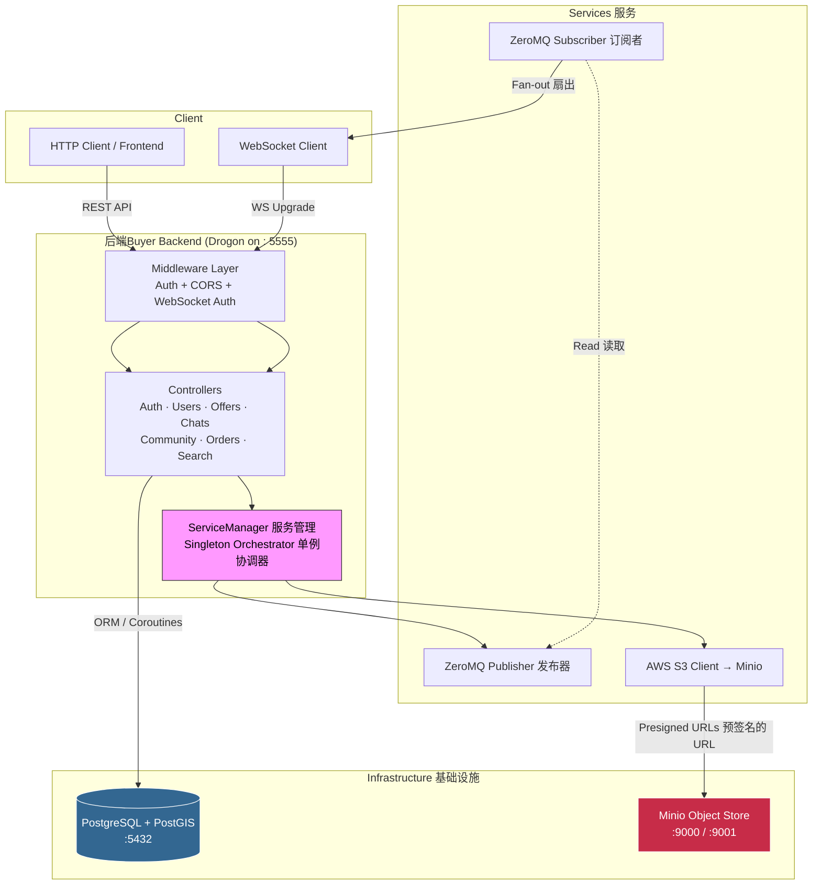

## 项目结构

```bash
buyer-backend/
├── main.cc                         # 应用入口  
├── CMakeLists.txt                  # 构建配置 (C++23、依赖项、测试目标)
├── vcpkg.json                      # vcpkg 包管理器的依赖清单
├── config-sample.json              # config.json 的模板 (生产环境)
├── test_config-sample.json         # test_config.json 的模板 (测试环境)
├── Dockerfile                      # 基于 drogonframework/drogon 的容器镜像
├── docker-compose.yml              # PostgreSQL+PostGIS、Minio、可选的应用容器
├── docker-compose.test.yml         # 隔离的测试基础设施
│
├── controllers/                    # HTTP 和 WebSocket 端点处理器
│   ├── authentication.{hpp,cc}     # 登录、注册、登出、令牌刷新
│   ├── community.{hpp,cc}          # 帖子 CRUD、订阅、标签
│   ├── offers.{hpp,cc}             # 报价、协商、凭证、担保交易
│   ├── offers_negotiation.cc       # 协商业务逻辑
│   ├── chats.{hpp,cc}              # 会话和消息
│   ├── orders.{hpp,cc}             # 订单管理
│   ├── search.{hpp,cc}             # 结合 PostGIS 的全文搜索
│   ├── location.{hpp,cc}           # 地理空间聚类和附近搜索
│   ├── media_server.{hpp,cpp}      # 预签名 URL、媒体元数据(通过预签名 URL 进行媒体上传/下载)
│   ├── notification_websocket.{hpp,cpp}  # WebSocket 实时推送
│   ├── dashboard.{hpp,cc}          # 仪表盘聚合端点
│   ├── users.{hpp,cc}              # 用户列表
│   ├── common_req_n_resp.hpp       # 共享结构体 (SimpleError、StatusResponse 等)
│   ├── scenario_specific_utils.hpp  # 特定领域的辅助逻辑
│   └── controller_template.hpp     # 用于生成新控制器的模板
│
├── filters/                        # Drogon HTTP 中间件
│   ├── AuthMiddleware.cc           # JWT Bearer 令牌验证 (基于协程)
│   ├── CorsMiddleware.cc           # 跨域资源共享(回环强制执行 + CORS 请求头)
│   └── WebSocketAuthMiddleware.cc  # WebSocket 的 JWT 验证 (查询参数 / 请求头)
│
├── services/                       # 后台业务服务和基础设施 (S3, ZeroMQ pub/sub)
│   ├── service_manager.hpp         # 单例：初始化 ZeroMQ、S3、订阅者线程
│   ├── media_server/
│   │   └── s3_service.{hpp,cpp}    # AWS S3 客户端封装 (预签名 URL、存储桶管理)
│   └── subber/                     # 发布/订阅通知管道
│       ├── connection_manager.hpp  # WebSocket 连接注册表与主题广播
│       ├── pub_manager.hpp         # ZeroMQ PUB 套接字封装(inproc://pubsub)
│       ├── sub_manager.hpp         # ZeroMQ SUB 套接字 + 分发线程(jthread 轮询循环)
│       ├── redis_pub_manager.hpp   # Redis 替代方案 (桩代码，未使用)
│       └── redis_sub_manager.{hpp,cpp}  # Redis 替代方案 (桩代码，未使用)
│
├── utilities/                      # 可复用的纯函数辅助工具
│   ├── conversion.hpp              # 类型转换工具
│   ├── json_manipulation.hpp       # JSON 解析和构建辅助函数
│   ├── validation.hpp              # 输入验证函数
│   ├── time_manipulation.hpp       # 时间戳格式化和解析
│   └── uuid_generator.hpp          # 基于 Boost.UUID 的 ID 生成
│
├── migrations/                     # 数据库架构 (PostgreSQL + PostGIS),数据库 Schema (通过 Docker init 自动应用)
│   └── 001_complete_schema.sql     # 所有表：users、posts、offers、messages 等
├── seeds/                          # 用于开发的样本数据 ,示例种子数据 (通过 Docker init 自动应用)
│   └── 001_complete_seed_data.sql
├── test/                           # 集成测试套件
│   ├── CMakeLists.txt
│   ├── test_main.cc
│   ├── helpers.hpp
│   └── test_*.cc                   # 每个领域一个测试文件
│
└── config/
    └── config.hpp                  # 运行时配置访问器 (JWT 密钥等)

```

## 依赖


| 库                       | 作用                                             |
| ------------------------ | ------------------------------------------------ |
| drogon[ctl,orm,postgres] | HTTP 框架，包含 ORM 和 PostgreSQL 驱动           |
| jwt-cpp                  | JWT 令牌的创建与验证                             |
| argon2[hwopt,tool]       | 密码哈希（PHC 竞赛获胜算法）                     |
| cppzmq                   | 用于发布/订阅通知的 ZeroMQ C++ 绑定              |
| aws-sdk-cpp[s3]          | 用于 Minio 对象存储的 S3 客户端                  |
| boost-uuid               | 高性能 UUID 生成                                 |
| unordered-dense          | 优化版哈希映射 (Ankerl)                          |
| glaze                    | 基于反射的 JSON 序列化（比 JsonCpp 快约 2.1 倍） |

## 启动

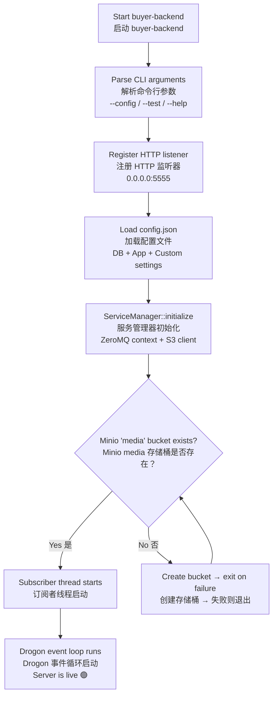

## Drogon 启动流程
应用使用 `drogon::sync_wait` 运行一个协程，以确保在接收流量之前 S3 的 "media" 存储桶已存在。这在启动时将 Drogon 的协程基础设施与 AWS SDK 的异步接口连接起来，如果对象存储层不可达，则会快速失败。
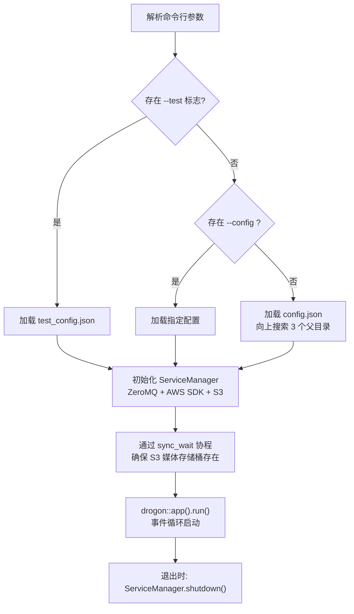

每个已认证端点的执行顺序始终为：CorsMiddleware跨域验证中间件 → AuthMiddleware认证 → 控制器处理程序。此顺序在每个 ADD_METHOD_TO 调用中声明，并由 Drogon 的框架调度强制执行。

## 架构概览
---

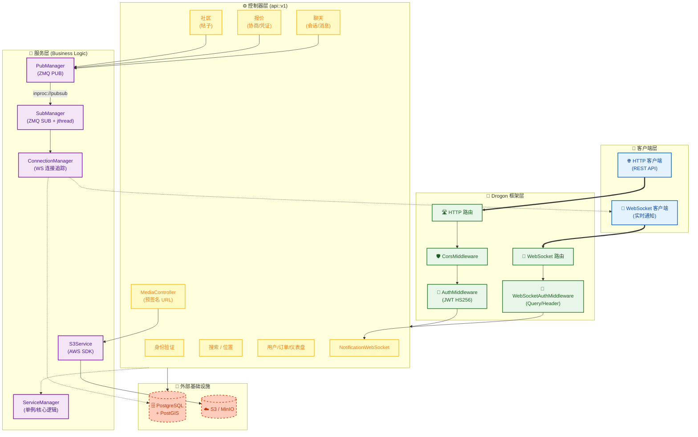
---

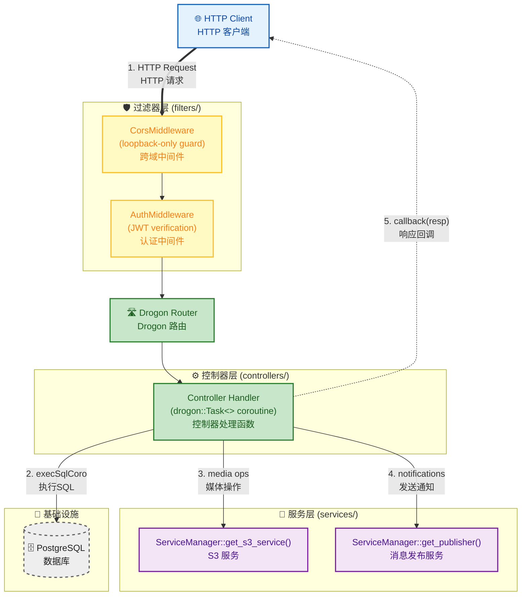
---

| 控制器 | 头文件 | 基类 | 端点数量 | 需要认证 | 领域 |
| :--- | :--- | :--- | :--- | :--- | :--- |
| `Authentication` | [authentication.hpp](controllers/authentication.hpp) | `HttpController` | 4 | 混合 | 身份认证 |
| `Users` | [users.hpp](controllers/users.hpp) | `HttpController` | 1 | 是 | 用户资料 |
| `Community` | [community.hpp](controllers/community.hpp) | `HttpController` | 11 | 是 | 帖子与订阅 |
| `Offers` | [offers.hpp](controllers/offers.hpp) | `HttpController` | 22 | 是 | 交易市场报价 |
| `Chats` | [chats.hpp](controllers/chats.hpp) | `HttpController` | 7 | 是 | 消息传递 |
| `Orders` | [orders.hpp](controllers/orders.hpp) | `HttpController` | 2 | 是 | 订单管理 |
| `Dashboard` | [dashboard.hpp](controllers/dashboard.hpp) | `HttpController` | 1 | 是 | 数据分析 |
| `Search` | [search.hpp](controllers/search.hpp) | `HttpController` | 1 | 是 | 地理空间搜索 |
| `LocationController` | [location.hpp](controllers/location.hpp) | `HttpController` | 4 | 是 | PostGIS 位置 |
| `MediaController` | [media_server.hpp](controllers/media_server.hpp) | `HttpController` | 5 | 是 | 预签名 URL |
| `NotificationWebSocket` | [notification_websocket.hpp](controllers/notification_websocket.hpp) | `WebSocketController` | 1 | 是 | 实时推送 |

`Authentication` 的“混合”认证状态反映了其设计：`/login`、`/register` 和 `/refresh` 不需要令牌（它们是签发令牌的端点），而 `/logout` 受 `AuthMiddleware` 保护，以识别要注销的会话所属的用户。
- 有两点观察至关重要。 
- 首先，每条路由都包含 `Options` ——这并非偶然。`CorsMiddleware` 本身并不处理预检 `OPTIONS` 请求；
- 相反，每条路由必须显式接受它们，以便 Drogon 的路由器能够匹配预检请求。
- 实际的 CORS 头注入发生在中间件的响应拦截器中（`CorsMiddleware.cc`）。
- 其次，`CorsMiddleware` 强制仅限环回访问 ——任何来自非环回 IP 的请求都会立即收到 404 响应。这是一个开发阶段的安全网，而非生产环境的 CORS 策略。

> `CorsMiddleware` 环回检查意味着在开发环境中，API 客户端必须通过 `127.0.0.1` 或 `::1` 进行连接。
> 来自局域网 IP（如 `192.168.x.x`）的请求将收到不带任何 CORS 头的 404 响应，这在浏览器中会表现为不透明的 CORS 错误——而不是明确的“需要环回”提示信息。
---

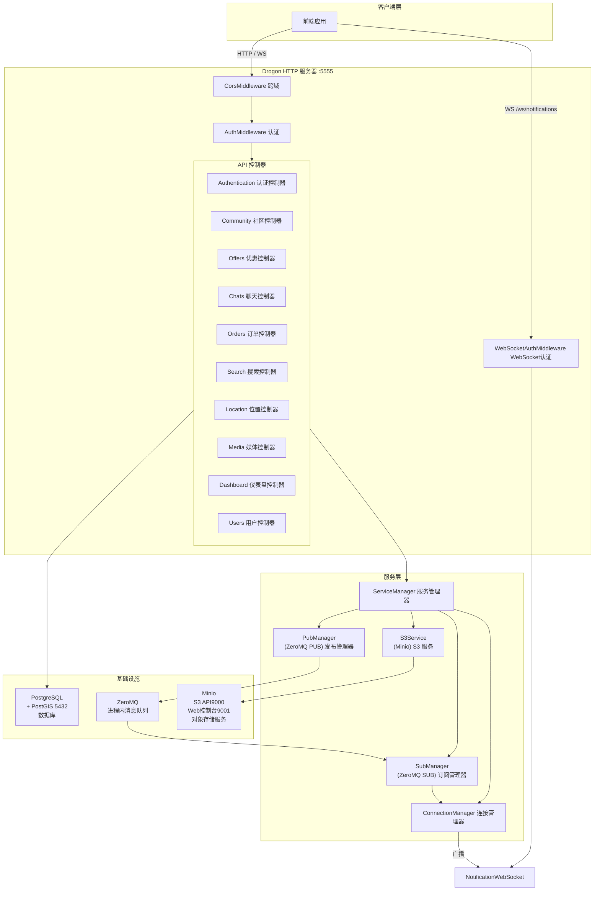

---
每个 HTTP 请求在到达控制器之前，都会经过一条**中间件链**。Drogon 支持同步（HttpMiddleware<T>）和基于协程（HttpCoroMiddleware<T>）的中间件，本项目两者兼用：
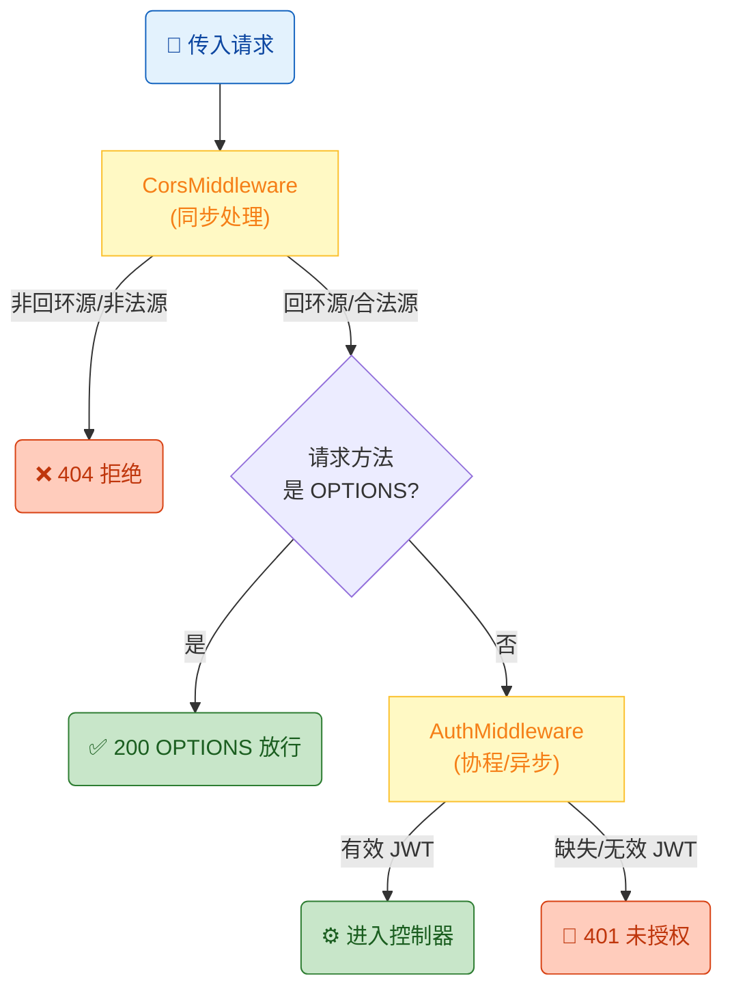
---
## 控制器执行流
每个经过认证的请求从到达至响应，都会经历一个五阶段管道。下图追踪了典型认证端点（如创建报价）的完整生命周期。

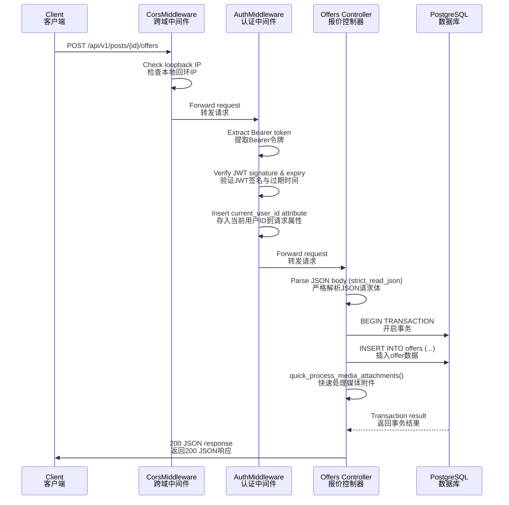

## 实时通知架构

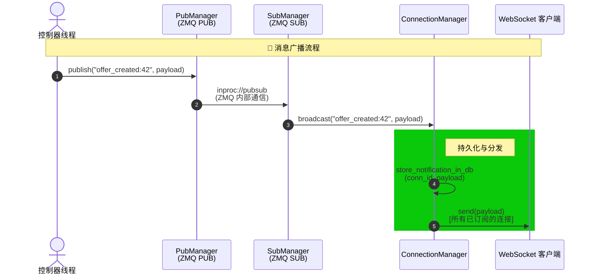

## JWT 身份验证流程

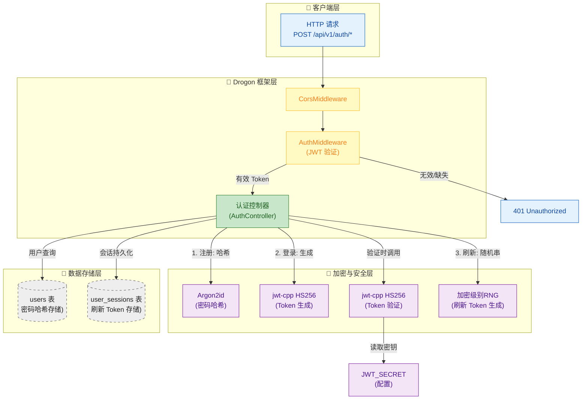

## 注册流程

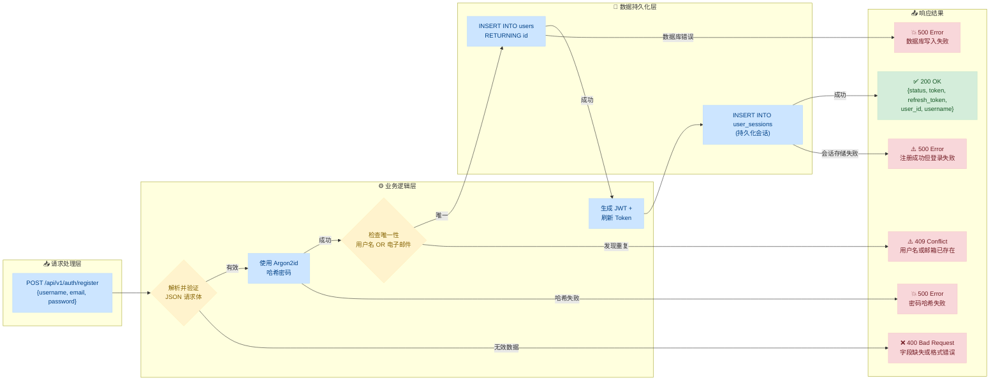

## Token 刷新流程

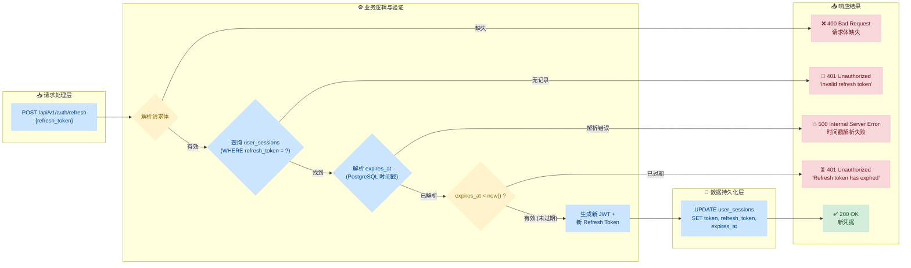

## 中间件过滤器

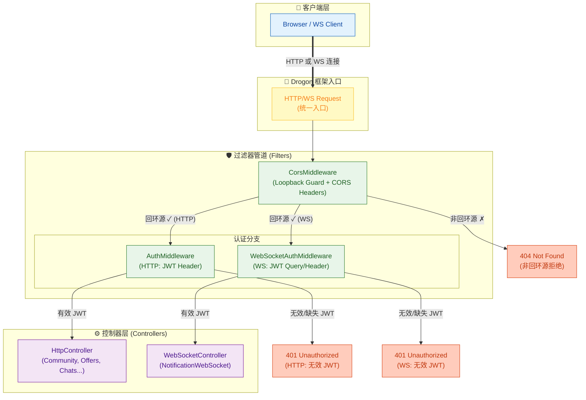

## 令牌提取与验证

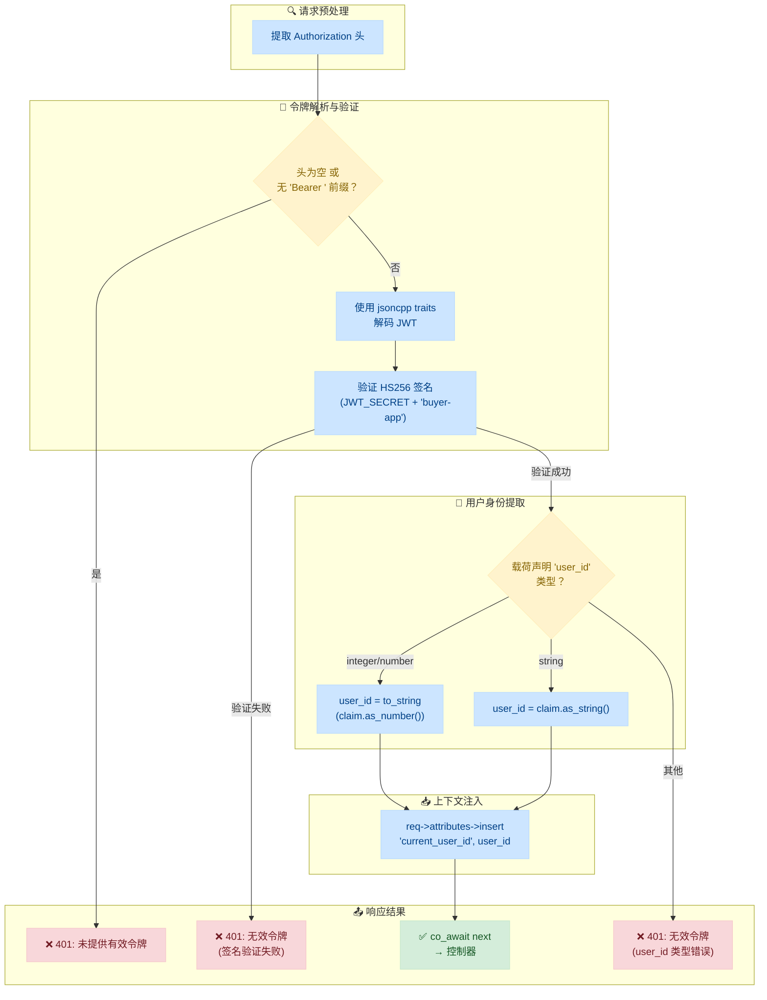